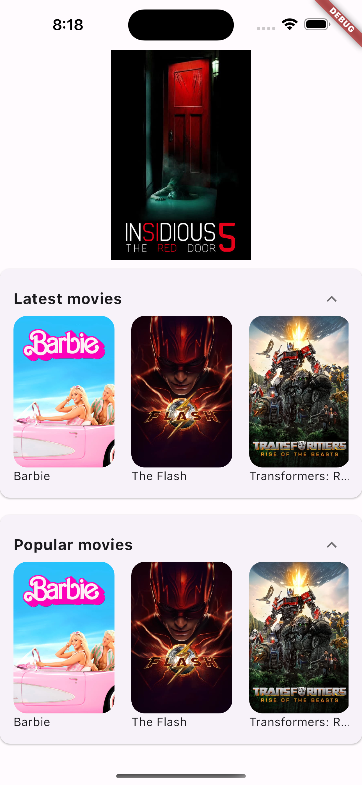
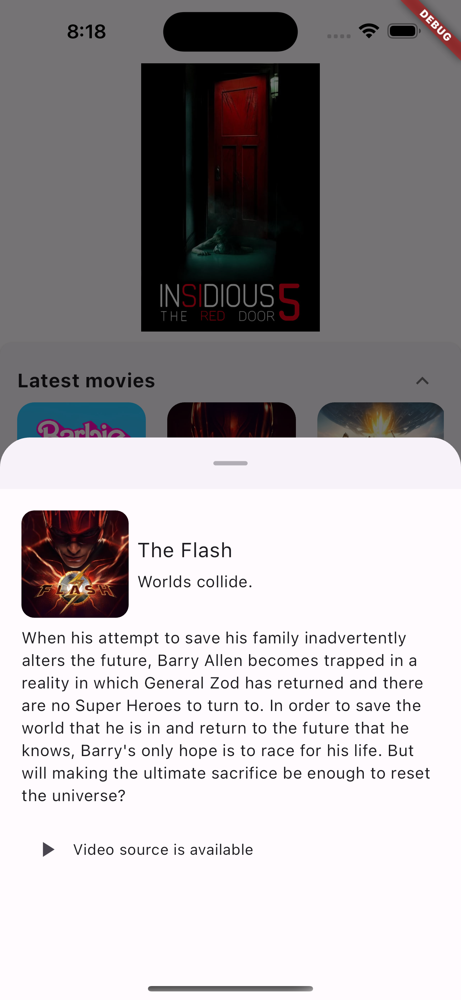
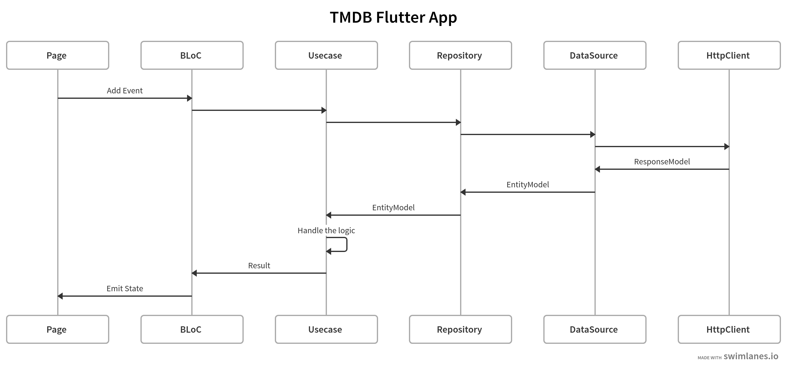

Movie app (TMDB) with Flutter using BLoC
============================
> Clean way of usage Data / Domain / Presentation with BLoC

 &nbsp; &nbsp; 

## Project architecture

## Folder structure of the project:
    ├── lib
    │   ├── app                   
    │   ├── core                
    │   │   ├── api                   
    │   │   ├── di                      
    │   │   ├── extension       
    │   │   └── route           
    │   └── features                  
    └── ... ├── feature_x
            │   ├── data
            │   │   ├── datasources   
            │   │   ├── models         
            │   │   └── repositories   
            │   ├── domain
            │   │   ├── entities        
            │   │   ├── repositories   
            │   │   └── usecases        
            │   └── presentation       
            │       ├── bloc
            │       ├── widget
            │       └── page.dart
            └── ...
